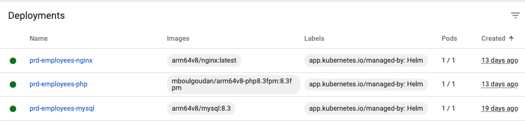

These are the steps to create a MySQL instance inside Kubernetes

# 0. Go to mysql directory inside helm
``cd helm/mysql``

# 1. Create 'prd' namespace
```shell
$ kubectl create -f namespace-prd.yaml
namespace/prd created
```

# 2. Create a storage class
``kubectl -n prd apply -f sc-mysql.yaml``

# 3. Create the persistent volume
```shell
$ kubectl -n prd apply -f pv-mysql.yaml
persistentvolume/mysql-pv created
```

# 4. Install MySQL Helm Chart
```shell
$ helm install --namespace prd prd-mysql .
NAME: prd-mysql
LAST DEPLOYED: Wed Mar 20 20:31:04 2024
NAMESPACE: prd
STATUS: deployed
REVISION: 1
TEST SUITE: None
```

# 5. For subsequent releases, run helm upgrade
``helm upgrade --namespace prd prd-mysql .``

# --------------------------------------------------------------------------
In helm directory, do these steps to install Nginx PHP-FPM inside Kubernetes
# 6. Create the app (Nginx-PHP) storage class
```shell
$ kubectl -n prd apply -f sc-app.yaml
storageclass.storage.k8s.io/app-pv created
```

# 7. Create the persistent volume to store app data
```shell
$ kubectl -n prd apply -f pv-app.yaml
persistentvolume/app-pv created
```

# 8. Install PHP-FPM Helm Chart
```shell
$ helm install --namespace prd prd-php ./php
NAME: prd-php
LAST DEPLOYED: Tue Mar 26 21:32:49 2024
NAMESPACE: prd
STATUS: deployed
REVISION: 1
TEST SUITE: None
```

If you want to upgrade php (REVISION will be incremented):
```shell
$ helm upgrade --namespace prd prd-php ./php
Release "prd-php" has been upgraded. Happy Helming!
NAME: prd-php
LAST DEPLOYED: Tue Mar 26 21:39:39 2024
NAMESPACE: prd
STATUS: deployed
REVISION: 2
```

# 9. Install Nginx Helm Chart
```shell
$ helm install --namespace prd prd-nginx ./nginx
NAME: prd-nginx
LAST DEPLOYED: Tue Mar 26 21:33:33 2024
NAMESPACE: prd
STATUS: deployed
REVISION: 1
TEST SUITE: None
```

This is a screenshort of the deployments:
